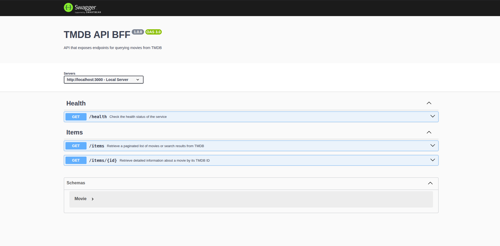
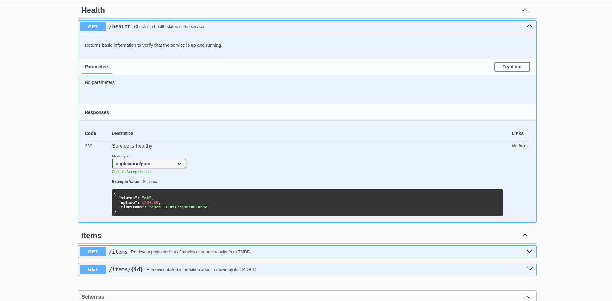
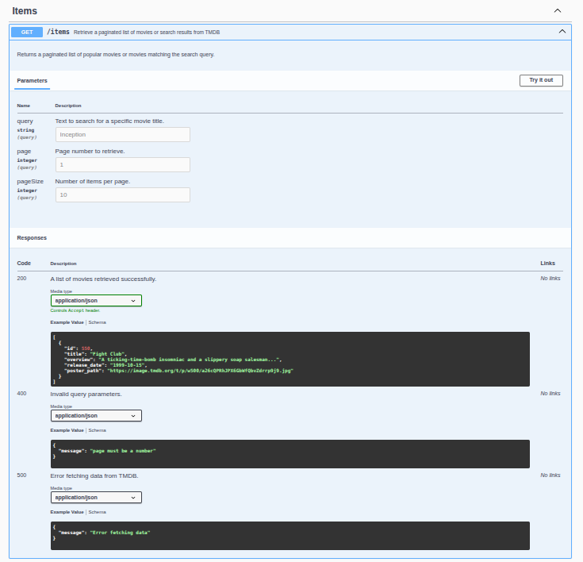
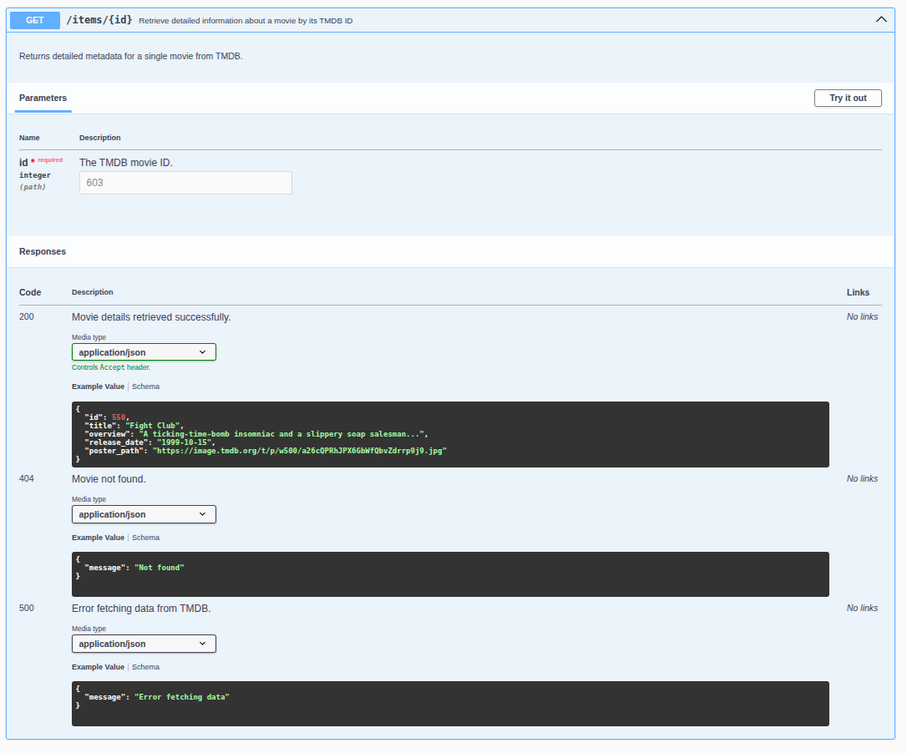

# 🎬 TMDB Backend API

Technical backend project built with **Node.js 22 + TypeScript + Express**, acting as a **BFF (Backend For Frontend)** for the public [The Movie Database (TMDB)](https://developer.themoviedb.org/) API.

The service exposes endpoints to fetch a paginated list of movies and detailed information for individual ones, plus a health check endpoint and Swagger documentation.

---

## 🚀 Technologies & Stack

* **Node.js 22**
* **TypeScript**
* **Express**
* **Axios** (TMDB consumption)
* **Swagger / OpenAPI 3** (API documentation)
* **ESLint 9 + Prettier** (linting and formatting)
* **Jest + Supertest** (testing)
* **Docker + Makefile** (automation)

---

## ⚙️ Installation & Execution

## 🔧 Prerequisites

- Node.js ≥ 22
- Docker
- API Key de TMDB ([Oficial Guide](https://developer.themoviedb.org/docs/getting-started))

### 🧩 Environment Variables

Create a `.env` file in the project root with the following content:

```env
PORT=3000
TMDB_BEARER_TOKEN=your_token
```

## 🏃‍♂️ Local Execution

```sh
# Install dependencies
npm install

# Run in development mode
npm run dev
```

Open in your browser: 👉 http://localhost:3000/health

## 🐳 Docker Execution

```sh
# Build and start the container
make build
make run
```

Or directly:

```sh
docker build -t tmdb-backend .
docker run -p 3000:3000 --env-file .env tmdb-backend
```

Open in your browser: 👉 http://localhost:3000/health

## 📚 Swagger Documentation

Once the service is running, access 👉 http://localhost:3000/docs

Here you can test the endpoints:

- GET /health — Service health status

- GET /items?page=&pageSize=&query= — Paginated movie list

- GET /items/:id — Movie details

## 🧱 Project Structure

```sh
src/
 ├── docs/                # Screenshots and utils for documentation
 ├── config/              # General configuration (Project and Swagger)
 ├── controllers/         # HTTP logic (Request/Response)
 ├── middlewares/         # Validations, error handling
 ├── routes/              # Endpoint definitions
 ├── services/            # TMDB communication layer
 ├── utils/               # Helpers and utilities
 ├── app.ts               # Express setup
 └── index.ts             # Entry point
tests/
 ├── health.test.ts
 └── items.test.ts
```

## 🧠 Technical Decisions

1. **Modular architecture:** separated into layers `controllers → services → routes → middlewares` to ensure scalability.

2. **Class-based design:** `TMDBService` and controllers implemented as classes to allow future dependency injection.

3. **Data normalization:** TMDB responses are simplified to return only relevant fields.

4. **Centralized error handling:** via a global `errorHandler` middleware and the `handleControllerErrors` utility.

5. **Integrated documentation:** Swagger config available at `/docs`.

6. **Automation:** Makefile includes tasks for `build`, `run`, `lint`, `test`, and `clean`.

7. **Testing:** Jest + Supertest for end-to-end integration testing of endpoints.

## 🧪 Testing

This project includes integration and end-to-end tests implemented with Jest and Supertest, covering both business logic and request validation.

### ⚙️ Running Tests

```sh
# Run all tests
npm run test
```

⚠️ Make sure your `TMDB_BEARER_TOKEN` variable is set in the `.env` file.

### ✅ Test Coverage

#### 🩺 HealthController

File: `tests/health.test.ts`

- `GET /health`
  - Ensures the service responds with `status 200`.

  - Checks that the response body includes:

    ```json
    {
      "status": "ok",
      "uptime": 123.45,
      "timestamp": "2025-11-06T15:00:00.000Z"
    }
    ```

  - Validates field types: `uptime` is a number and `timestamp` is an ISO string.

#### 🎬 ItemController

File: `tests/items.test.ts`

**Test cases::**

`GET /items`

- Returns a paginated list of movies from TMDB.

- Accepts parameters `query`, `page` and `pageSize`.

- Verifies:
  - HTTP code `200 OK`

  - Response is an array

  - Each item includes properties like `id` and `title`.

`GET /items/:id`

- Returns movie details for an existing ID (e.g., 550 = Fight Club).

- Verifies:
  - HTTP code `200 OK`

  - Response includes fields such as `id` and `title`.

`GET /items/:id` **\*with a non-existent ID**

- Simulates a request with an invalid ID (`9999999999`).

- Verifies:
  - HTTP code `404`

  - TMDB-style error structure:

    ```json
    {
      "success": false,
      "status_message": "The resource you requested could not be found."
    }
    ```

#### 🧱 Middleware Validations

File: `tests/items.test.ts` (additional block)

`GET /items` **– Query validation**

- Returns `400` if the `query` parameter is missing.

- Returns `400` if `page` is not numeric.

- Returns `400` if `pageSize` is not numeric.

`GET /items/:id` **– Path validation**

- Returns `400` if `id` is not numeric.

## 🐙 Git

- **GitFlow** was used during development for branching and version control.

## 📸 Swagger Screenshots

### 🧭 Swagger Documentation



### 🩺 Endpoint /health



### 🎬 Endpoint /items (list)



### 🎞️ Endpoint /items/:id (details)



### 📄 Schemas


---

## 🧰 Additional Tools Used

### 📬 Postman

A Postman collection is included with all the endpoints configured for easier manual testing.

📁 File: [`docs/TMDB_Backend_Postman_Collection.json`](./docs/TMDB_Backend_Postman_Collection.json)

To import it into Postman:

1. Open Postman
2. Go to File → Import
3. Select the `.json` file

---

### 📋 Asana

A PDF report is attached showing the tasks planned and completed during the development process.

📄 File: [`docs/Asana_Tasks_Report.pdf`](./docs/Asana_Tasks_Report.pdf)

The document includes:

- Planning of main tasks (setup, endpoints, tests, Docker, README)
